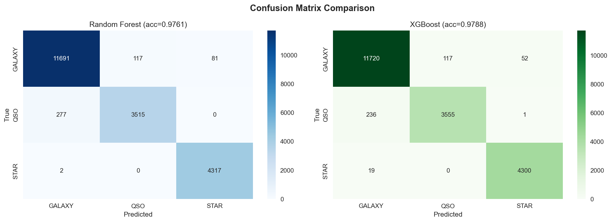
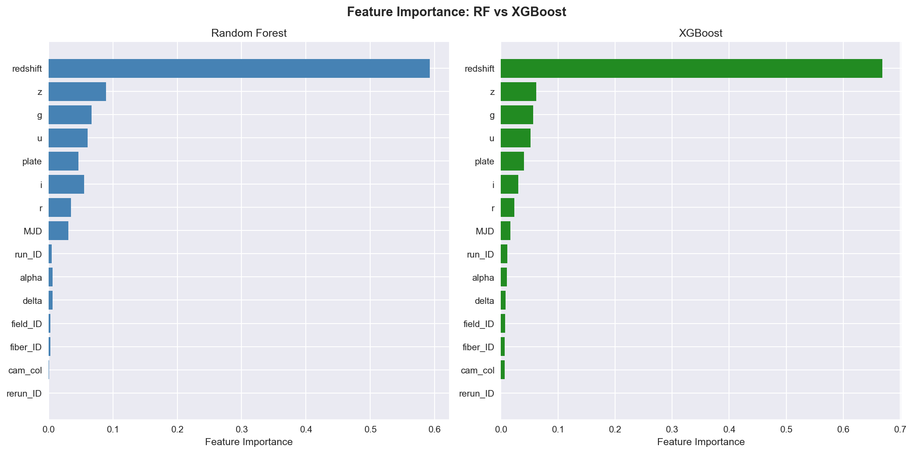
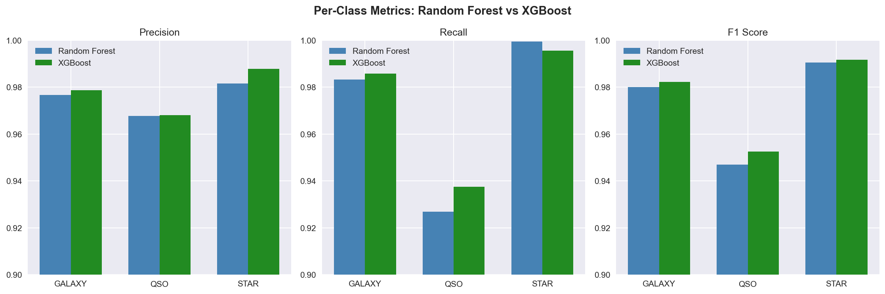

# SDSS / SDSS-style spectra classification

Supervised multiclass classification of astronomical objects (**star**, **galaxy**, **quasar**) from photometry and metadata similar to the Sloan Digital Sky Survey (SDSS). This repo includes a [Random Forest](https://scikit-learn.org/stable/modules/generated/sklearn.ensemble.RandomForestClassifier.html) baseline, a small Python package layout (`main.py`, `analysis.py`), and an interactive walkthrough in `sdss_analysis.ipynb`.

**Repository:** [github.com/saanikakulkarni07/sdss-spectra-classification](https://github.com/saanikakulkarni07/sdss-spectra-classification)

## Documentation

| Doc | Description |
|-----|-------------|
| [GETTING_STARTED.md](GETTING_STARTED.md) | Onboarding: environment, what to run first, file roles, troubleshooting |
| [lab-notes / 01 — Lessons learned](lab-notes/01-lessons-learned.md) | Theory-first takeaways (supervised risk, scaling, leakage, importance) |
| [lab-notes / 02 — Future work](lab-notes/02-future-work.md) | Approximation vs estimation, priors, calibration, features, shift |
| [lab-notes / 03 — Why misclassifications happen](lab-notes/03-why-misclassifications-happen.md) | Bayes error, overlap in \(p(x|y)\), label noise, confident errors |

## Dataset

Data in this repo comes from the Kaggle dataset **Stellar Classification Dataset — SDSS17** ([download / data tab](https://www.kaggle.com/datasets/fedesoriano/stellar-classification-dataset-sdss17/data), published by [fedesoriano](https://www.kaggle.com/fedesoriano)).

- **Bundled file:** `dataset/star_classification.csv` (100,000 rows, 18 columns).
- **Target:** `class` (GALAXY, STAR, QSO).
- **Features:** SDSS-style magnitudes `u, g, r, i, z`, positions (`alpha`, `delta`), `redshift`, plate/MJD/fiber identifiers, and related IDs.

If you clone without the CSV, download the dataset from Kaggle (account required), unzip if needed, and place `star_classification.csv` under `dataset/` (or adjust paths in the notebook / `load_data.py`).

## Model approach

- Random Forest classifier on scaled numeric features (`StandardScaler`).
- Train/test split, classification report, confusion matrix, optional cross-validation on the test split.
- Feature importance from the fitted forest.

## Results (from the notebook)

On the held-out test set (20,000 samples), the notebook reports **test accuracy ≈ 0.976** and **5-fold CV mean accuracy ≈ 0.974** (see `sdss_analysis.ipynb` for exact runs). Figures below are exported from the notebook outputs in `docs/plots/` (regenerate anytime by running the notebook and saving outputs).

### Class distribution


### Feature correlations


### Distributions by class


### Confusion matrix


### Precision, recall, F1, and normalized confusion matrices


### Misclassification analysis


### Feature importance


## Remodeling using XGBoost
I chose to use XGBoost because both Random Forest and XGB are in the same family, however, XGB builds trees sequentially which boosts the accuracy of the model, making it more of an informative comparison. XGB also puts more attention to samples the model gets wrong, whereas Random Forest weights all samples equally.

### Accuracy

With max_depth=7 and 200 estimators, XGBoost achieves 97.88% test accuracy compared to the Random Forest baseline of 97.61%, a +0.27% improvement. The 5-fold cross-validation mean is 97.72% (± 0.0017), more stable than RF's 97.39% (± 0.0026). The biggest per-class gain is on QSOs (F1: 0.9526 vs 0.9469), the hardest class due to photometric overlap with galaxies at intermediate redshifts. Of the 20,000 test samples, XGBoost correctly classifies 115 objects that RF misses, while RF only gets 63 that XGBoost misses — boosting's sequential error-correction helps most on the boundary cases (star vs galaxy comparison). 

This result is statistically significant, according to McNemar's Test (p-value = 0.000132).

### XGB vs RF Confusion Matrix Comparison



### XGB vs RF Feature Importance 



### Type of Object Metrics for RF and XGB



## Installation

```bash
git clone git@github.com:prashantkul/sdss-spectra-classification.git
cd sdss-spectra-classification
python -m venv .venv
source .venv/bin/activate   # Windows: .venv\Scripts\activate
pip install -r requirements.txt
```

For the notebook, install a kernel environment (e.g. `pip install ipykernel jupyter` or use `uv sync` if you use the `pyproject.toml` in this project).

## Usage

**CLI training / evaluation:**

```bash
python main.py
```

**Notebook:**

```bash
jupyter notebook sdss_analysis.ipynb
```

[](https://colab.research.google.com/github/prashantkul/sdss-spectra-classification/blob/main/sdss_analysis.ipynb)

*(After first push, upload `dataset/star_classification.csv` to Colab or mount Drive if you run remotely.)*

## Project layout

| Path | Role |
|------|------|
| [GETTING_STARTED.md](GETTING_STARTED.md), [lab-notes/](lab-notes/) | Narrative docs — see [Documentation](#documentation) |
| `sdss_analysis.ipynb` | End-to-end EDA, training, metrics, plots |
| `main.py` | Script entrypoint |
| `analysis.py`, `load_data.py`, `config.py` | Training and data helpers |
| `dataset/` | CSV (and optional `archive.zip`) |
| `docs/plots/` | Notebook figures for the README |

## References

- [Stellar Classification Dataset — SDSS17 (Kaggle)](https://www.kaggle.com/datasets/fedesoriano/stellar-classification-dataset-sdss17/data)
- [Sloan Digital Sky Survey](https://www.sdss.org/)
- [scikit-learn user guide](https://scikit-learn.org/stable/user_guide.html)
